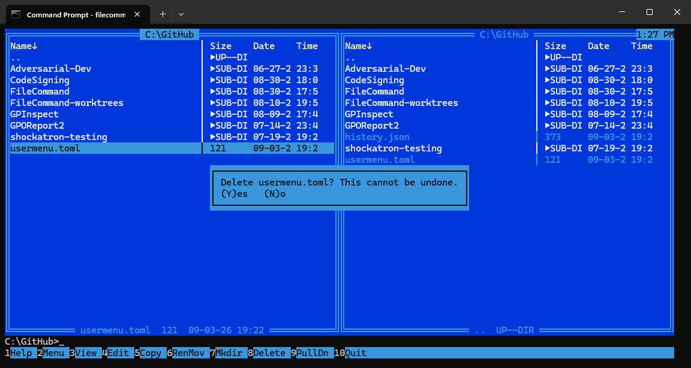
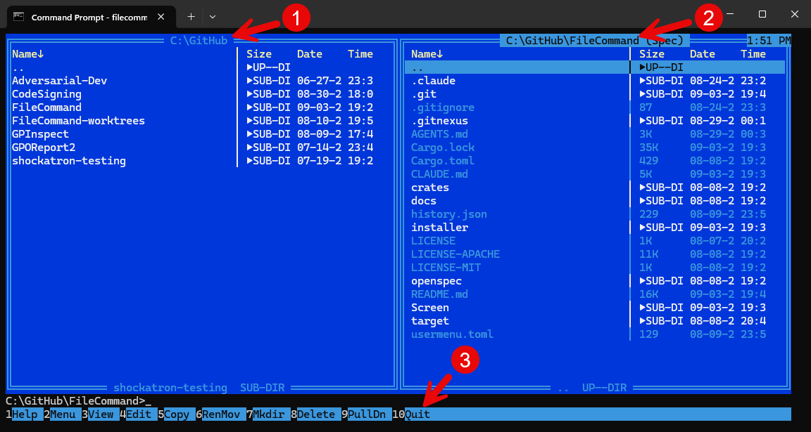

# FileCommand

A keyboard-driven, dual-panel file manager for the terminal, written in Rust
([ratatui](https://github.com/ratatui/ratatui) + [crossterm](https://github.com/crossterm-rs/crossterm)).
It recreates the look, layout, and workflow of Norton Commander 5.5 (1998) —
blue/cyan panels, double-line frames, a function-key command bar, and an
always-available command line — with a small set of modern extras layered on
top: quick filter, fuzzy directory jump, panel tabs, git-aware panel info,
mouse support, and switchable themes.

**Platform:** Windows-first (Windows Terminal / PowerShell console / `conhost`).
The codebase stays cross-platform via `crossterm`, but only Windows is tested
and supported.



## Contents

- [Installing](#installing)
- [Building from source](#building-from-source)
- [Command-line options](#command-line-options)
- [Configuration](#configuration)
- [Using FileCommand](#using-filecommand)
  - [Screen layout](#screen-layout)
  - [Keyboard reference](#keyboard-reference)
  - [Mouse reference](#mouse-reference)
  - [Pull-down menus (F9)](#pull-down-menus-f9)
  - [Panel display modes](#panel-display-modes)
  - [File operations](#file-operations)
  - [Viewer (F3) and editor (F4)](#viewer-f3-and-editor-f4)
  - [Themes](#themes)
- [Project layout](#project-layout)
- [Testing](#testing)
- [Contributing](#contributing)
- [License](#license)

## Installing

The easiest way to get FileCommand on Windows is the bundled installer:

1. Build (or download) `FileCommandSetup.exe` — see
   [`installer/README.md`](installer/README.md) for build instructions,
   prerequisites (Rust, .NET SDK, WiX v4/v5 CLI), and a winget manifest.
2. Run it. By default it installs **per-user, with no elevation**, to
   `%LocalAppData%\Programs\BigHatGroup\FileCommand`, adds itself to your
   user `PATH`, and creates a Start Menu shortcut.
3. Open a **new** terminal window (existing ones won't see the updated
   `PATH`) and run:

   ```powershell
   filecommand
   ```

For an elevated, machine-wide install instead:

```powershell
FileCommandSetup.exe /quiet InstallScope=perMachine
```

Silent uninstall:

```powershell
FileCommandSetup.exe /uninstall /quiet
```

See [`installer/README.md`](installer/README.md) for the full scope
semantics (per-user vs. per-machine, upgrade behavior, production code
signing) and the winget package template.

## Building from source

Requires the [Rust toolchain](https://rustup.rs) (stable).

```powershell
git clone https://github.com/kkaminsk/FileCommand.git
cd FileCommand
cargo build --release
```

The binary is produced at `target\release\filecommand.exe`. Run it directly,
or via Cargo:

```powershell
cargo run --release
```

The workspace has two crates:

- `filecommand-core` — state, the reducer (`core::update`), file operations,
  listing/sorting/filtering, git info, config/theme loading. No terminal
  dependencies; fully unit-testable.
- `filecommand-tui` — the `filecommand` binary: the event loop, rendering,
  input mapping, and terminal ownership.

## Command-line options

| Flag | Effect |
|---|---|
| `--theme <name>` or `--theme=<name>` | Launch with a specific theme for this session, overriding the saved `theme =` in `config.toml`. Built-in names: `nc-classic`, `nc-mono`, `terminal-green`, `purple-lights`, `yellow-storm`, `inverted`. |
| `--nosplash` | Skip the startup splash screen, overriding `splash = true` in `config.toml`. |
| `--nomouse` | Disable mouse capture for this session, overriding `[mouse] enabled` in `config.toml`. |

Flags can be combined in any order, e.g. `filecommand --nosplash --theme=purple-lights`.

## Configuration

FileCommand reads and writes its files in the current working directory
(the directory it's launched from), not a fixed profile directory. Missing
files are created with defaults on first run; a malformed file produces a
startup warning and falls back to defaults rather than being silently
overwritten.

### `config.toml`

Flat `key = value` lines (not a full TOML parser, aside from the `[mouse]`
table below), one setting per line:

```toml
splash = true
theme = "nc-classic"
shell = "cmd.exe /C"
editor = "code -w"
panel_split = 50

[mouse]
enabled = true

key.paste_name = "ctrl+enter"
key.paste_path = "ctrl+]"
key.quick_filter = "ctrl+p"
key.fuzzy_jump = "ctrl+j"
key.split_left = "ctrl+left"
key.split_right = "ctrl+right"
key.split_reset = "ctrl+="
key.clipboard_files = "ctrl+c"
key.clipboard_paths = "ctrl+shift+insert"
```

| Key | Meaning | Default |
|---|---|---|
| `splash` | Show the startup splash screen. | `true` |
| `theme` | Active theme name (built-in or a file in `themes/`). | `nc-classic` |
| `shell` | Shell command line used for command-line passthrough. | `cmd.exe /C` on Windows, `/bin/sh -c` elsewhere |
| `editor` | External editor command for F4; unset means "use the built-in editor". | unset |
| `panel_split` | Left-panel width as a percentage. | `50` |
| `[mouse] enabled` | Whether mouse capture is enabled at all. | `true` |
| `key.*` | Overridable key bindings (see table below). | see below |

Only the bindings listed above are configurable; the rest of the key map
(F-keys, Tab, arrows, Ctrl+T/W, etc.) is fixed. Unknown keys are ignored
rather than rejected, and the schema tolerates missing/malformed lines.

### `themes/*.toml`

User-defined themes. Each theme maps the role names documented in the design
spec (`panel.frame`, `panel.cursor`, `dialog.primary`, ...) to ANSI-16 color
names (`black`, `red`, `green`, `yellow`, `blue`, `magenta`, `cyan`, `white`,
and `bright-` variants), with an optional per-role `#RRGGBB` truecolor
override. Switch themes at runtime via **Options → Themes**, or pin one at
launch with `--theme`.

### `usermenu.toml`

F2 user-menu entries — a real TOML array of tables:

```toml
[[entry]]
label = "Open command prompt here"
command = "cmd.exe"

[[entry]]
label = "Directory listing"
command = "dir"
```

Unlike `config.toml`, a malformed `usermenu.toml` is treated as an error: it
falls back to a default menu and shows a warning rather than being silently
overwritten.

### `history.json`

Command-line history and fuzzy-jump directory frecency data, written
atomically so a crash mid-write never corrupts it. Not meant to be hand-edited.

## Using FileCommand

### Screen layout



1. **Left navigation pane** — its own directory, cursor, selection, sort
   mode, filter, and display mode; the path renders inverse in the top
   border when this panel is active.
2. **Right navigation pane** — independent of the left: its own mode, sort,
   filter, and tabs, so the two panels can browse entirely different
   locations at once.
3. **F-key menu** — the function-key command bar (`1Help 2Menu 3View 4Edit
   5Copy 6RenMov 7Mkdir 8Delete 9PullDn 10Quit`); clickable with the mouse,
   and relabels under Ctrl/Alt for their key-bar variants.

- Two independent panels, each with its own directory, cursor, selection,
  sort mode, filter, and display mode.
- **Tab** switches which panel is active (the active panel's path renders
  inverse in its top border).
- **The command line** always shows the active panel's path. Typing goes to
  the command line whenever no dialog, menu, or quick-search/quick-filter
  input has claimed the keyboard; **Enter** runs it, spawning the configured
  shell and suspending the TUI until it exits.
- Terminal is usable down to a minimum size; below that, panels are replaced
  with a "terminal too small" placeholder and the F-key bar degrades through
  progressively shorter forms as width shrinks.
- The startup splash (product name/version banner) is the very first frame
  unless `--nosplash`/`splash = false`; any key dismisses it early.

### Keyboard reference

**Navigation & panels**

| Key | Action |
|---|---|
| ↑ / ↓ / PgUp / PgDn / Home / End | Move cursor (page size follows panel height) |
| Tab | Switch active panel |
| Enter | Directory: enter it. `..`: go to parent. File: opens the file-action menu (Run/View/Edit/Copy/Rename/Move/Delete/Send to clipboard). Command line non-empty: runs it. Tree mode: navigate/expand. |
| Backspace (empty command line) | Parent directory |
| Ctrl+PgUp | Parent directory |
| Ins | Toggle selection at cursor, cursor advances |
| + / - / * | Select by wildcard / deselect by wildcard / invert selection |
| Alt+letter | Start type-ahead jump to the first matching entry |
| Ctrl+P | Toggle the inline quick filter (narrows the panel to a substring match as you type) |
| Ctrl+J | Fuzzy directory-jump dialog (frecency-ranked, persists across sessions) |
| Alt+F7 | Find file |
| Ctrl+R | Re-read (refresh) the active panel |
| Ctrl+L | Toggle Info display mode on the active panel |
| Ctrl+O | Show terminal scrollback (leaves the alternate screen; any key returns) |
| Ctrl+T / Ctrl+W | New tab / close tab on the active panel |
| Alt+1..9 | Switch to tab *n* on the active panel |
| Ctrl+←/→ | Shrink / grow the left panel (adjust the split) |
| Ctrl+= | Reset the split to 50/50 |
| Alt+F1 / Alt+F2 | Drive select for the left / right panel |
| Ctrl+F3..F6 | Sort active panel by Name / Extension / Time / Size |
| Ctrl+F7 | Unsorted (raw enumeration order) |

**File operations**

| Key | Action |
|---|---|
| F3 | View file under cursor |
| F4 | Edit file under cursor (external editor if configured, else the built-in editor; large files open in the viewer instead) |
| F5 | Copy |
| F6 | Rename/Move |
| F7 | Make directory |
| F8 | Delete (confirmation; a second confirmation for non-empty directories) |
| Ctrl+C or Ctrl+Ins | Copy the cursor entry (or selection) to the Windows clipboard as file objects, pasteable into Explorer |
| Ctrl+Shift+Ins | Copy the cursor entry's (or selection's) absolute path(s) to the clipboard as text |
| Ctrl+Enter | Paste the cursor entry's file name onto the command line |
| Ctrl+] | Paste the cursor entry's full path onto the command line |

**General**

| Key | Action |
|---|---|
| F1 | Help |
| F2 | User menu (from `usermenu.toml`) |
| F9 | Open the pull-down menu bar |
| F10 or Esc | Request quit (Y/N confirmation) |
| Esc (in a dialog/menu/overlay) | Cancel or close it |
| Up / Down (command line non-empty) | Recall previous/next command-line history |

All of the bindings marked overridable in [Configuration](#configuration)
(`paste_name`, `paste_path`, `quick_filter`, `fuzzy_jump`, `split_left`,
`split_right`, `split_reset`, `clipboard_files`, `clipboard_paths`) can be
remapped in `config.toml`; the rest of the table above is fixed.

### Mouse reference

Enabled by default; disable with `[mouse] enabled = false` or `--nomouse`.
Mouse is only honored in contexts a key press would also reach (panels, the
key bar, menu titles/items, and dialog buttons) — it does nothing in the
viewer/editor beyond wheel scrolling, and nothing at all while an
unsupported overlay (drive select, fuzzy jump, find file, user menu, theme
picker, help, startup warning) is open.

| Gesture | Action |
|---|---|
| Left click on an entry | Focus that panel and move the cursor to the entry |
| Ctrl+left click on an entry | Toggle that entry's selection in place |
| Double left click on an entry | Same as Enter |
| Left click on empty panel area / title | Focus that panel |
| Right click on an entry | Open the file-action menu for it |
| Left-drag from an entry onto a target | Propose a **Copy** |
| Right-drag, or Shift+drag, from an entry | Propose a **Move** |
| Esc during a drag | Cancel the drag |
| Scroll wheel over a panel | Scroll 3 lines |
| Click a key-bar slot | Activate that F-key |
| Click a menu-bar title / pull-down item | Open / activate it; clicking outside an open pull-down closes it |
| Click a dialog button | Activate it |

### Pull-down menus (F9)

Five menus, navigated with ←/→ (between menus), ↑/↓ (within one), Enter,
Esc, or a hotkey letter:

- **Left / Right** (mirror each other, acting on their own panel): display
  mode (Brief/Full/Tree/Quick view/Info), sort mode, re-read, drive select,
  new/close tab.
- **Files**: View, Edit, Copy, Rename/Move, Make directory, Delete, copy to
  clipboard (files/paths/names), Select/Deselect/Invert group, Quit.
- **Commands**: Find file, Fuzzy jump, Panels on/off. (History, Swap panels,
  Compare directories, and Menu file edit are listed but not yet
  implemented — greyed out.)
- **Options**: Themes (opens the live theme picker). (Configuration, Editor
  selection, and Save setup are listed but not yet implemented.)

### Panel display modes

| Mode | Description |
|---|---|
| **Full** (default) | Name \| Size \| Date \| Time columns |
| **Brief** | Three columns of names only |
| **Info** (Ctrl+L) | Drive/system/directory info instead of a listing |
| **Tree** | Lazily-expanded directory tree of the current drive; moving the cursor updates the *opposite* panel's listing |
| **Quick view** | Live preview (text head) of the file under the *opposite* panel's cursor |

### File operations

Copy (F5), Move/Rename (F6), Mkdir (F7), and Delete (F8) run as cancellable
background jobs with a progress dialog (file/byte counts, a cancel button).
Overwrite conflicts prompt Overwrite/Skip/Rename/Overwrite All/Skip All;
errors (permission denied, path too long, disk full, sharing violation)
pause the job for Retry/Skip/Skip All/Abort, and skipped files are listed in
a summary at the end. Same-volume moves are instant renames; cross-volume
moves copy then delete only after the copy verifies. There is no recycle
bin — deletes are permanent, and the confirmation dialog says so.

### Viewer (F3) and editor (F4)

- **Viewer** — read-only, opens instantly at any file size (streams/memory-maps
  rather than indexing). F2 toggles wrap, F4 toggles text/hex mode, F7
  searches, F10/Esc closes.
- **Editor** — F4 opens your configured external editor if `editor =` is set
  in `config.toml`; otherwise the built-in editor (files under 10 MB; larger
  files open in the viewer instead). F2 saves, F3 marks a line-selection
  anchor, F4 opens search-and-replace, F7 searches, Ctrl+X/C/V cut/copy/paste,
  Ctrl+Z undoes, F10 quits (prompting to save if modified).

### Themes

Six built-in themes: `nc-classic` (default, the authentic NC palette),
`nc-mono` (black/white), `terminal-green`, `purple-lights`, `yellow-storm`,
and `inverted`. Switch live via **Options → Themes** (arrow keys preview
each theme before you commit) or the F2 user menu; the choice persists to
`config.toml`. Pin a theme for a single session with `--theme <name>`
without touching the saved default.

## Project layout

```
FileCommand/
├── crates/
│   ├── filecommand-core/   # state, reducer, fs ops, git info — no UI deps
│   └── filecommand-tui/    # ratatui + crossterm binary (the `filecommand` exe)
├── installer/              # WiX (v4/v5) MSI + Burn bootstrapper packaging
├── openspec/                # OpenSpec proposals and per-capability specs
│   └── specs/                # source of truth for current behavior
├── docs/superpowers/specs/  # original full design document
└── Screen/                  # screenshots used in this README
```

## Testing

```powershell
cargo test --workspace
```

Covers `filecommand-core` unit and property-based tests (file ops against
temp directories, sorting/filtering, selection semantics, config/theme
parsing, git info against fixture repos) and `filecommand-tui` ratatui
`TestBackend` snapshot tests (panels, dialogs, viewer/editor, splash, help,
menus) via `insta`.

## Contributing

This project develops behind an OpenSpec-driven, branch-per-change
workflow: research and proposals happen on `Spec`, get merged to `main`,
then each approved proposal is implemented on its own `build/<name>` branch
off `main`. Nothing lands on `main` without an explicit human go-ahead. See
`CLAUDE.md` for the full rules.

## License

Dual-licensed under [MIT](LICENSE-MIT) or [Apache-2.0](LICENSE-APACHE), at
your option.
